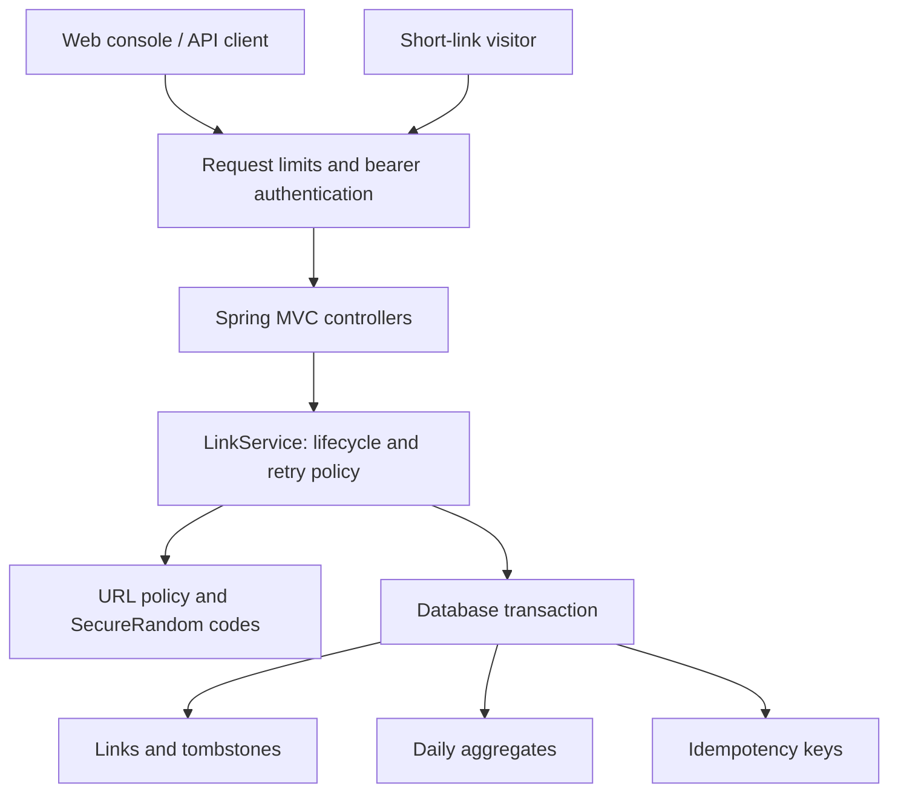

# Architecture and decisions

The URL shortener is one deployable service with clear module boundaries. It uses Java 17 records for API contracts, constructor injection, Bean Validation, Spring Security, JPA repositories and Flyway migrations. PostgreSQL is the deployment database; the default H2 file profile is for a local demo, not evidence of PostgreSQL compatibility by itself.

AI assistance happens outside this control flow, during engineering tasks. No runtime AI orchestration or API key for an LLM is required.

## Request flow

Create: validate the request → authenticate the operator → enforce URL policy → fingerprint normalized fields → check durable retry key → insert the new resource and retry record in one transaction → return 201. The actual HTTP security filters authenticate before the controller deserializes the body. Matching retries return 200 and the same resource's current representation.

Redirect: locate and lock the link row → evaluate expiry/disable at the injected UTC clock → increment lifetime and daily aggregates in the same transaction → commit → return 302 and `Cache-Control: no-store`. HEAD uses the same lifecycle checks but does not count. There is no server-side destination request, preview crawler or DNS lookup for arbitrary hostnames.

Analytics: lock the same link row → read lifetime total and recent daily rows → fill missing UTC dates with zero → return a consistent view. Counts reflect committed resolutions, not confirmed receipt of a redirect or a visit to the destination. A process can crash after commit and before the client receives the response. Client retries and bot GETs can count again; exact-once human visits are not claimed.

## Decisions and costs

| Decision | Why | Consequence / future change |
| --- | --- | --- |
| Java 17 + Spring Boot | Matches the owner's role requirements and provides standard enterprise primitives | More dependencies and startup cost than a minimal server; pin versions and scan dependencies |
| One service, separate packages | A reviewer can follow the complete flow without distributed deployment | Extract services only after measurable ownership or scaling pressure |
| Full destination preservation | Query parameters and fragments can change resource identity | The same URL can have multiple campaign links; no automatic deduplication |
| 72-bit random codes | Unpredictable, with DB uniqueness as the final arbiter | Collision retry capped at five fresh transactions; namespace not an access-control secret |
| Pessimistic row lock | Prevent lost counts and serialize disable against in-flight redirects across instances | Hot links serialize; benchmark honestly; introduce an outbox/event pipeline only if needed |
| Count before redirect | Lifetime and daily counters commit together | Analytics/storage failure makes redirect return 503; availability trade-off is explicit |
| Soft disable, no code reuse | Old shared links can never resolve to an unrelated future destination | Tombstones consume storage; destructive retention policy needs human approval |
| One operator bearer token | Clear management/public boundary for the prototype | No tenants, roles or end-user accounts; add OIDC and resource ownership for a hosted product |
| Process-local rate limits | Bounded admission without another service | Limits multiply across replicas; ignored proxy headers mean a trusted edge is needed in deployment |
| No visitor identifiers | Minimize personal data collection | No unique-visitor, geo or referrer reporting |

## Schema evolution

- V1: links, version, creation metadata and lifetime counts.
- V2: nullable expiry/disabled timestamps and daily aggregate table. Existing links stay active; old lifetime counts remain. Historical daily counts cannot be reconstructed, so they are not invented.
- V3: hashed idempotency key, request fingerprint and foreign key to the created link. Existing resources continue to work without retry records.

Flyway validates applied checksums at startup. Do not edit a migration that has been deployed. Take a backup before applying schema changes. These migrations are additive; rolling back the binary must be rehearsed against the retained schema. Do not automatically run destructive down-migrations.

## Scaling and failure boundaries

JPA connection pooling limits concurrent database work. Row locks coordinate multiple Java processes; Java locks are used only for the process-local admission limiter. Set a PostgreSQL lock timeout and return a retryable storage error on contention. Liveness is process availability; readiness includes the database.

Before adding redirect caching, decide how expiration, disable invalidation and analytics will work. Caching 302s at a CDN changes counts and can serve a disabled link until TTL. Before moving analytics off the request path, specify delivery/duplication semantics and use an outbox or another atomic handoff; a fire-and-forget publish would silently lose events.

This prototype does not claim an availability SLA, multi-region consistency, unlimited hot-link throughput, destination safety scanning, distributed rate limiting or production readiness without further review.
